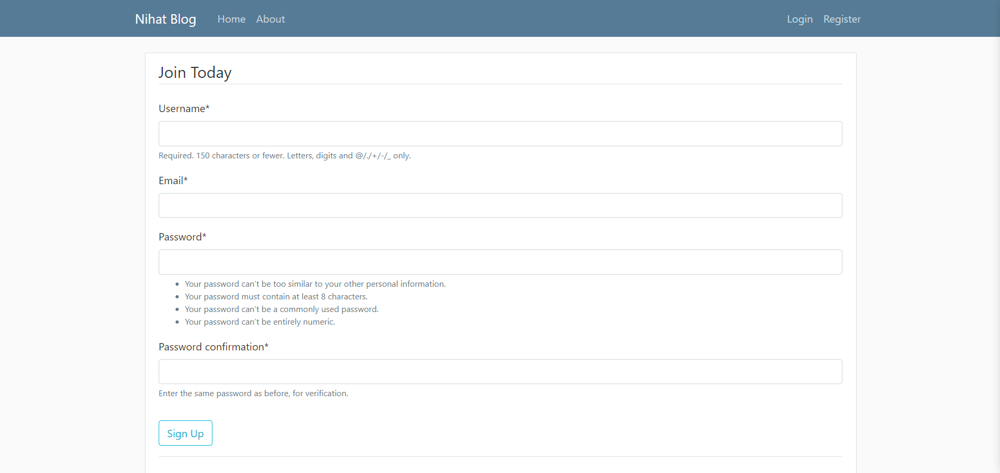
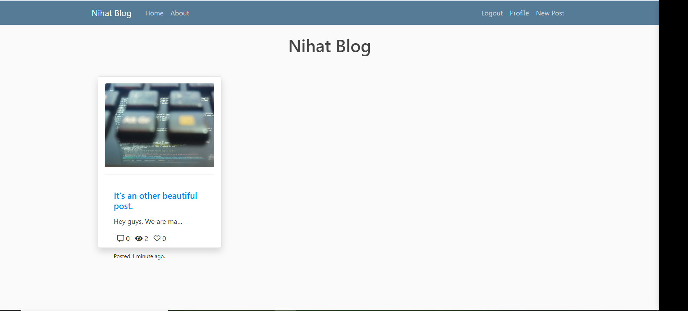
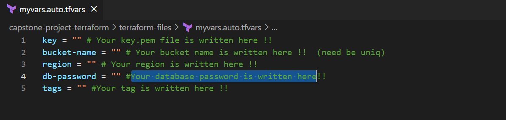

# nihat-blog-project-terraform

![Project_004][def]

[def]: nihat-blog.jpg

Description:
The Nihat Blog Page Application aims to deploy blog application as a web application written Django Framework on AWS Cloud Infrastructure. This infrastructure has Application Load Balancer with Auto Scaling Group of Elastic Compute Cloud (EC2) Instances and Relational Database Service (RDS) on defined VPC. Also, The Cloudfront and Route 53 services are located in front of the architecture and manage the traffic in secure. User is able to upload pictures and videos on own blog page and these are kept on S3 Bucket. This architecture was created using by Terraform.

Outcome:

Register Page:

Home Page:

NOTE: You must customize your variable in  terraform-files/myvars.auto.tfvars file.

