# NIHAT-BLOG-PROJECT-TERRAFORM

# Description:

Here is my Nihat Blog Page Application. With this project I aim to deploy blog application as a web application written Django Framework on AWS Cloud Infrastructure. There are two public, two private subnets and one AZ has NAT Instance (it can be used as bastion host) and public subnets routed internet gateway. This infrastructure has Application Load Balancer with Auto Scaling Group of Elastic Compute Cloud (EC2) Instances and Relational Database Service (RDS) on defined VPC. Also, The Cloudfront and Route 53 services are located in front of the architecture and manage the traffic in secure. User is able to upload pictures and videos on own blog page and these are kept on S3 Bucket. 

Besides creating this AWS project on the console, I wrote a terraform file to create the whole project with terraform.

# Road Map:

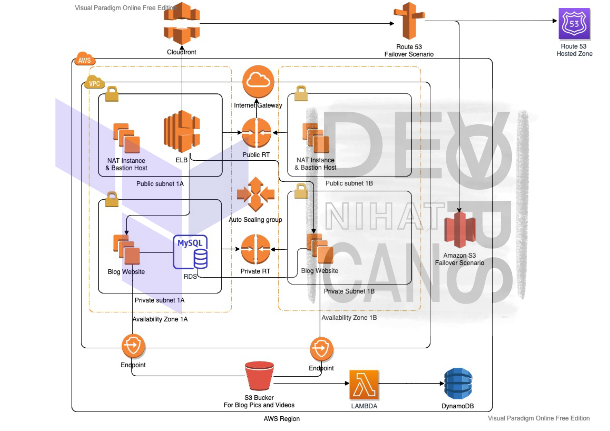

# AWS - Console

VPC: 

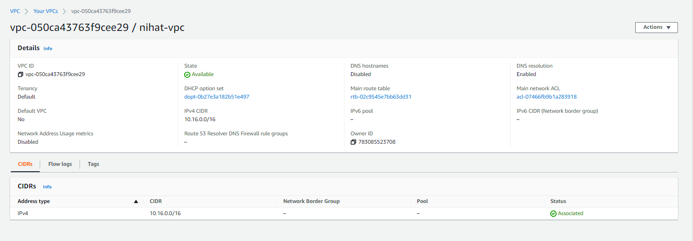

Public Route Table: 

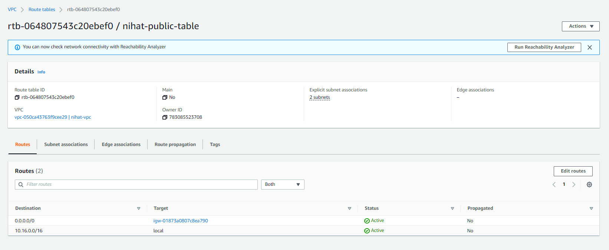

Private Route Table: 

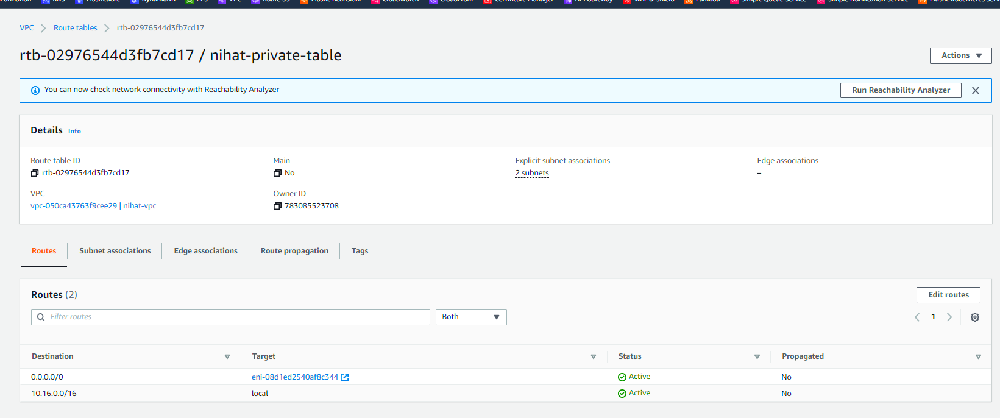

Security Groups:

Load Balancer Security Group:

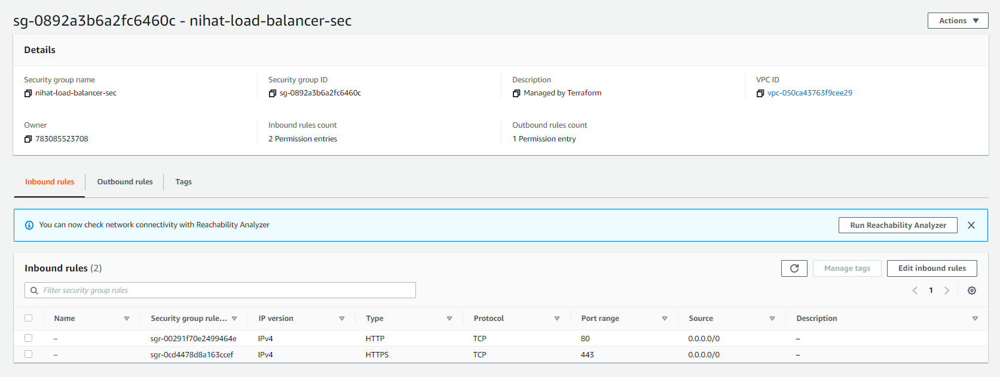

RDS Security Group:

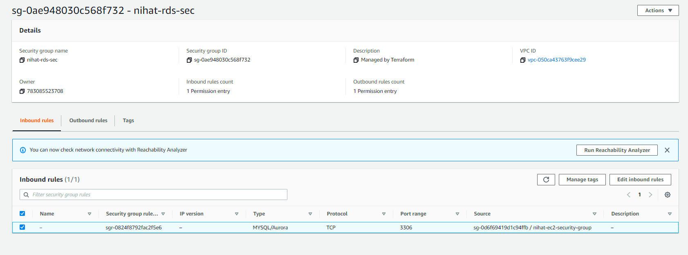

NAT Instace Security Group:

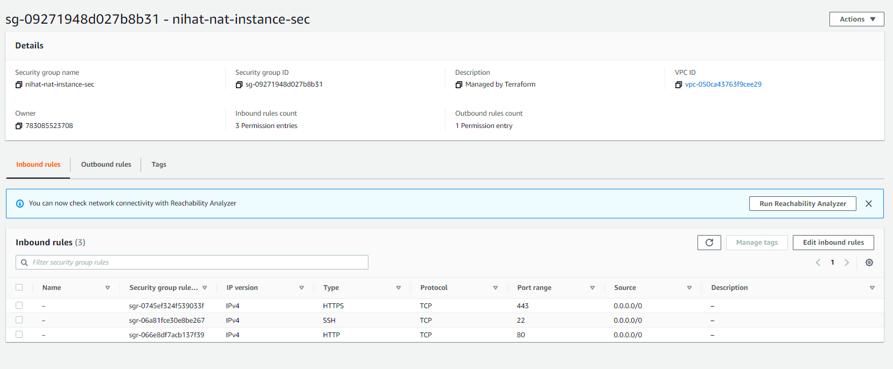

Blog Instance Security Group: 

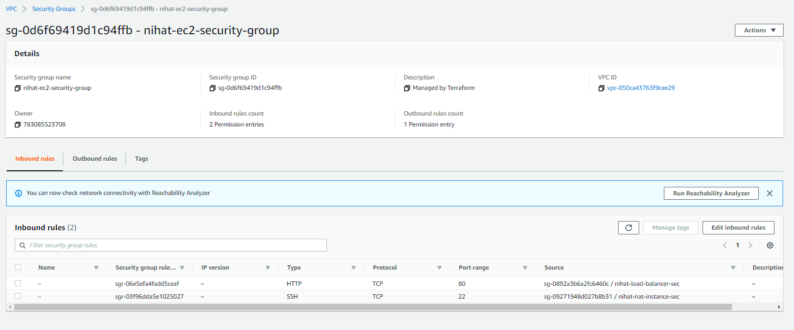

Blog Instance:

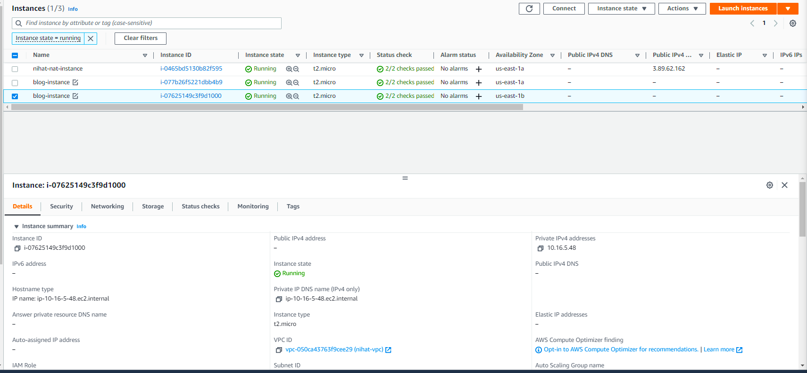

Nat Instance: 

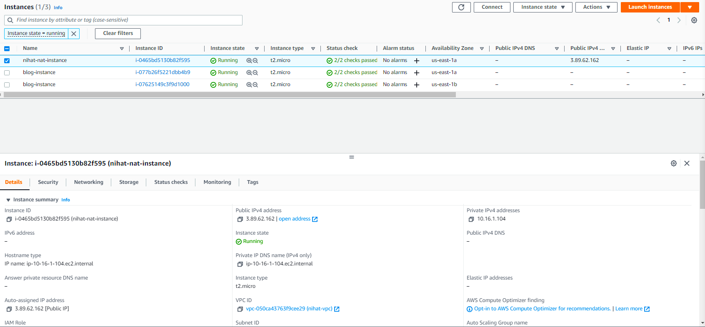

Target Group:

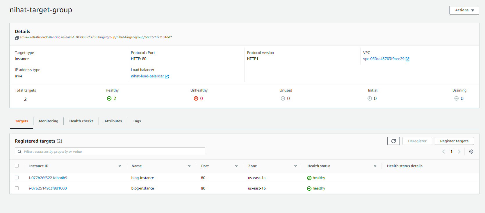

Load Balancer:

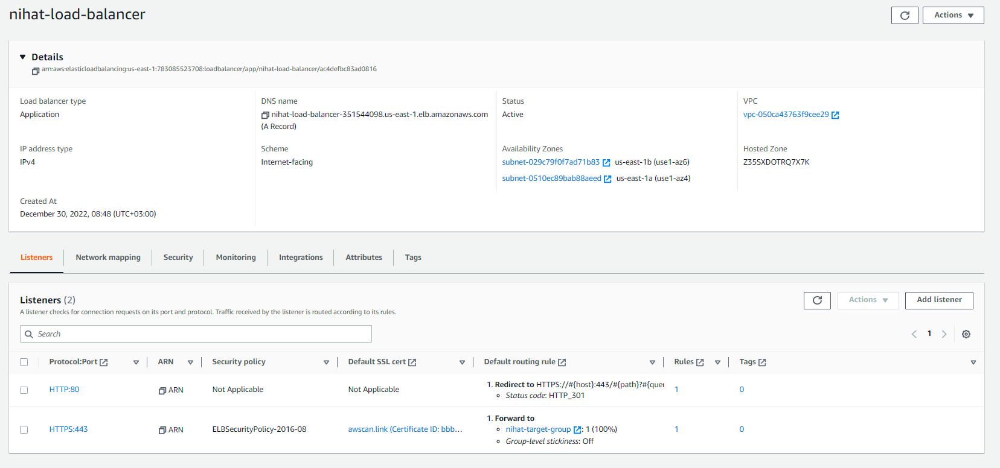

Auto Scaling Group:

S3 Bucket:

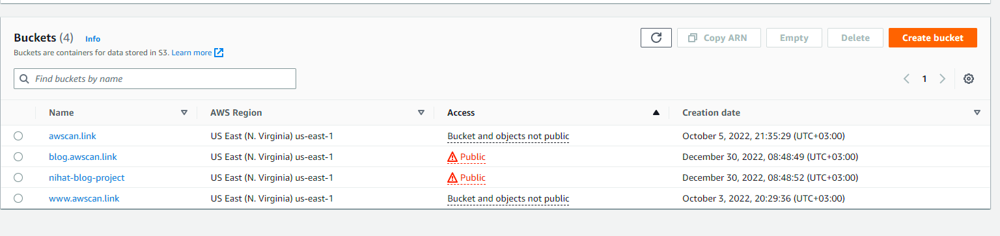

DynamoDB Table:

Lambda:

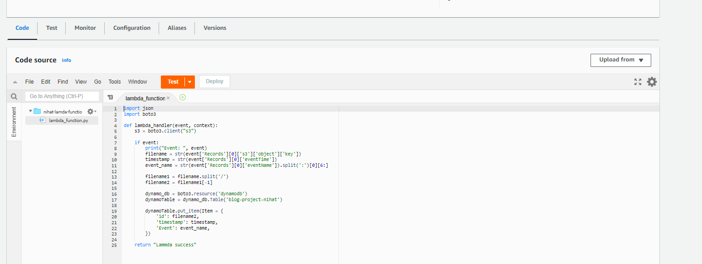

Cloudfront:

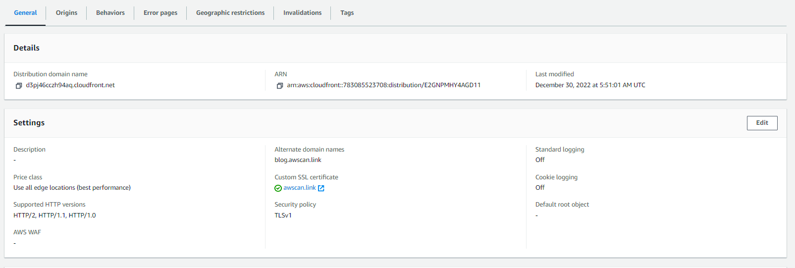

Route53:

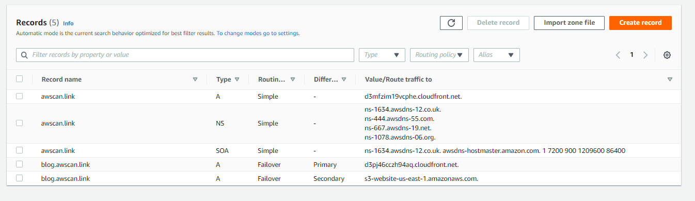

# Outcome:

Home Page:

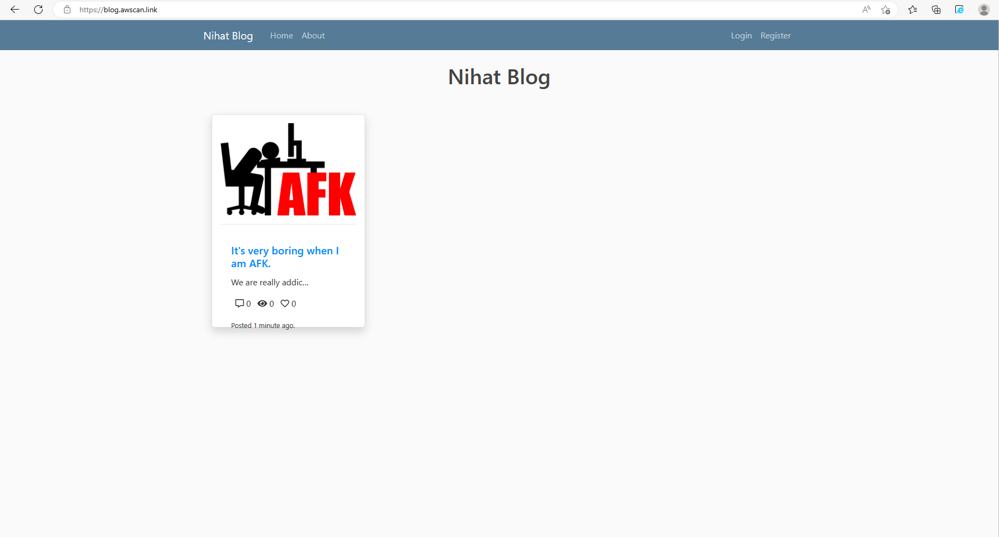

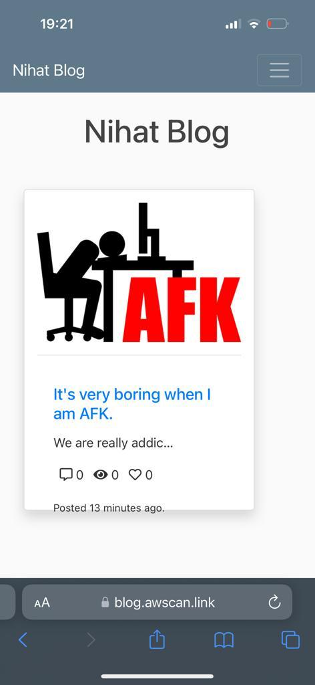

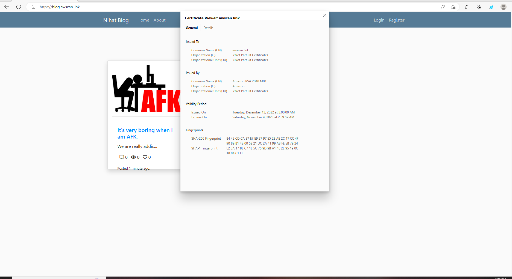

Profile Page:

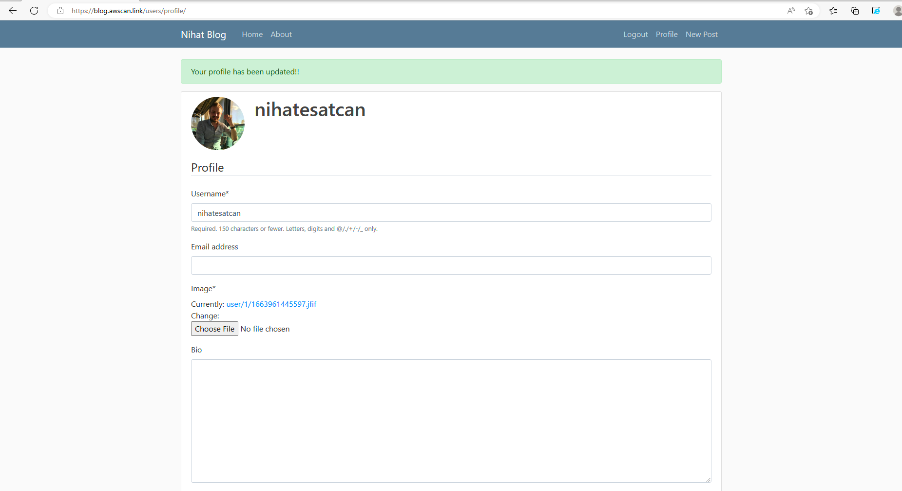

Post Page:

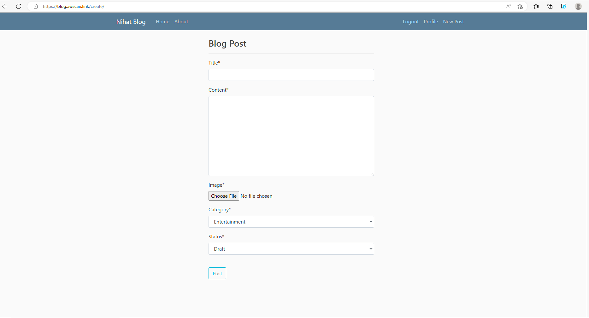

# Note !!

Dont forget customize terraform-files/myvars.auto.tfvars file !!

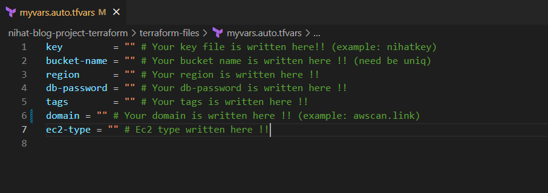